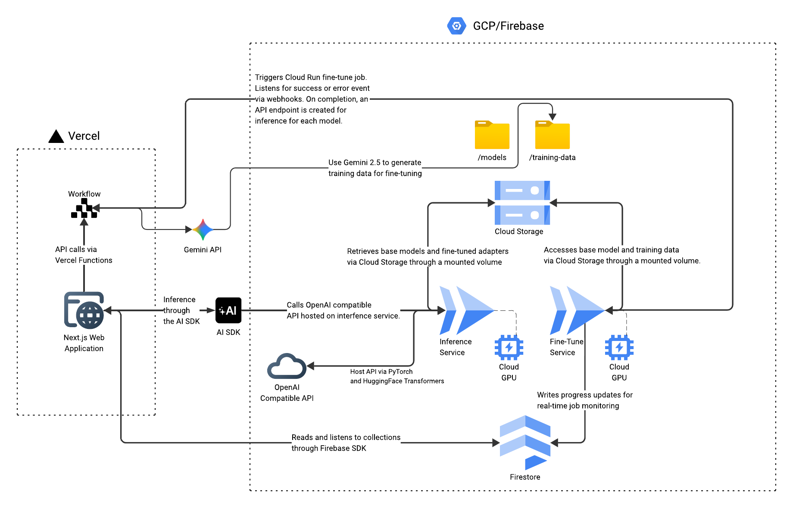

# tuneloom

A production-ready SaaS platform for fine-tuning and deploying language models
with GPU acceleration. Built on Google Cloud Platform with serverless
architecture for cost-effective scaling.

## Overview

**tuneloom** enables users to fine-tune language models on custom datasets and
deploy them for inference through an OpenAI-compatible API. The platform handles
the complete lifecycle from training data generation to model deployment and
serving.

## Architecture



### System Components

**tuneloom** consists of three main services:

#### 1. Web Application ([web/](web/))

**Technology**: Next.js 15.5.5 with TypeScript, React 19

**Purpose**: User-facing web application for managing fine-tuning jobs and model
inference

**Key Features**:

- Firebase Authentication for user management
- Training data generation using Google Gemini API
- Fine-tuning job creation and monitoring
- Real-time chat interface with deployed models
- API key management for model access
- Rate limiting with Upstash Redis

**Backend**: Vercel Functions with Hono 4.10.2 for REST API communication

**State Management**: Zustand for client state, React Query for server state, Firebase Authentication for auth

#### 2. Fine-Tune Service ([fine-tune-service/](fine-tune-service/))

**Technology**: Python 3.10, PyTorch 2.5.1, Transformers, PEFT

**Purpose**: GPU-accelerated model fine-tuning as Cloud Run Jobs

**Key Features**:

- QLoRA (4-bit quantization) for memory-efficient training
- LoRA adapter training for parameter-efficient fine-tuning
- Multiple training data formats (text, chat, instruction)
- Automatic model merging and upload to GCS
- GCS mounted as volume for fast model loading

**GPU**: NVIDIA L4 (32GB VRAM) with CUDA 12.1

**Deployment**: Cloud Run Jobs with automatic scaling to zero and GCS volume mount

#### 3. Inference Service ([inference-service/](inference-service/))

**Technology**: Python 3.10, FastAPI, PyTorch 2.5.1

**Purpose**: Serves fine-tuned models with OpenAI-compatible API

**Key Features**:

- OpenAI API compatibility for chat and completion endpoints
- Loads base model and dynamically loads user-specific LoRA adapters
- In-memory LRU cache for adapters to optimize inference performance
- GCS mounted as volume for fast model loading
- Streaming response support
- Firestore-based API key authentication

**GPU**: NVIDIA L4 (32GB VRAM) with CUDA 12.1

**Deployment**: Cloud Run Service with GPU support and GCS volume mount

### Data Flow

#### Training Flow

1. User uploads or generates training data via web interface
2. Training data stored in Firebase Storage (Google Cloud Storage)
3. User initiates fine-tuning job with configuration
4. Vercel Workflow triggers Cloud Run Job
5. Cloud Run Job:
   - Downloads training data from GCS
   - Downloads/caches base model
   - Fine-tunes using PyTorch + LoRA
   - Uploads fine-tuned model to GCS
   - Sends completion webhook to Workflow
6. Workflow updates Firestore with model status and generates API key

#### Inference Flow

1. User or API client sends request to web application
2. Web application forwards to Inference Service via REST API
3. Inference Service:
   - Validates API key via Firestore
   - Loads base model from GCS volume mount (if not cached)
   - Loads user-specific LoRA adapters (cached in LRU cache)
   - Generates response using GPU
   - Streams tokens back to client
4. Response displayed in web interface or returned to API client

The inference service uses an in-memory LRU cache for adapters and mounts GCS as a volume for fast model access, enabling quick inference with limited resources.

Note: Users can run inference directly if they have an API endpoint and valid API Key.

## Technology Stack

### Frontend

- **Framework**: Next.js 15.5.5 (React 19.1.0)
- **Language**: TypeScript 5
- **Styling**: Tailwind CSS 4 with Radix UI components
- **State Management**: Zustand, React Query
- **AI SDK**: Vercel AI SDK for streaming inference
- **Authentication**: Firebase Auth

### Backend

- **Web API**: Vercel Functions with Hono for REST API
- **GPU Services**: 2 Python 3.10 services on Cloud Run with NVIDIA L4 GPUs
  - Inference Service: FastAPI for model serving
  - Fine-Tune Service: PyTorch training with LoRA/QLoRA
- **ML Framework**: PyTorch 2.5.1
- **Model Hub**: HuggingFace Transformers 4.49.0
- **Fine-tuning**: PEFT 0.13.0 (LoRA), TRL 0.7.0
- **Quantization**: bitsandbytes for 4-bit/8-bit quantization

### Infrastructure

- **Cloud Platform**: Google Cloud Platform
- **Compute**: 2 Cloud Run services with GPU (NVIDIA L4) and GCS volume mounts
- **Storage**: Google Cloud Storage (models, adapters, training data)
- **Database**: Firebase Firestore (models, model versions, API keys, fine-tune jobs)
- **Cache**: Upstash Redis (rate limiting), In-memory LRU (adapter caching)
- **Workflow**: Vercel Workflow for long-running fine-tuning tasks
- **Container Registry**: Google Artifact Registry

## Getting Started

### Prerequisites

- Node.js 18+ (for web application)
- Python 3.10+ (for backend services)
- Google Cloud Platform account with billing enabled
- Firebase project
- Docker (for local development)

### Quick Start

#### 1. Web Application

```bash
cd web
npm install
cp .env.example .env  # Configure environment variables
npm run dev
```

The application will be available at http://localhost:1011

#### 2. Save base models into GCS

In order to do fine-tuning you need to download the base models from HuggingFace
and upload them into GCS. In this way, the inference-service and
fine-tune-service can read the base models from GCS.

```
cd inference-service/scripts
pip install -r requirements.txt
python download_model_to_gcs.py --model-id "google/gemma-3-270m"
```

#### 3. Inference Service

```bash
cd inference-service
pip install -r requirements.txt
python inference-server.py
```

See [inference-service/README.md](inference-service/README.md) for detailed
setup.

#### 4. Fine-Tune Service

```bash
cd fine-tune-service
./deploy.sh  # Deploy to Cloud Run Jobs
```

See [fine-tune-service/README.md](fine-tune-service/README.md) for detailed
configuration.

## Environment Configuration

### Web Application

```env
# Firebase Configuration
NEXT_PUBLIC_FIREBASE_API_KEY=your-api-key
NEXT_PUBLIC_FIREBASE_AUTH_DOMAIN=your-auth-domain
NEXT_PUBLIC_FIREBASE_PROJECT_ID=your-project-id
NEXT_PUBLIC_FIREBASE_STORAGE_BUCKET=your-storage-bucket
FIREBASE_SERVICE_ACCOUNT_KEY=base64-encoded-service-account-json

# API Configuration
OPENAI_COMPATIBLE_BASE_URL=https://your-inference-service-url
BASE_MODEL_API_KEY=your-api-key

# Rate Limiting
UPSTASH_REDIS_REST_URL=your-redis-url
UPSTASH_REDIS_REST_TOKEN=your-redis-token

# Training Data Generation
GOOGLE_GENERATIVE_AI_API_KEY=your-gemini-api-key

# Security
API_KEY_ENCRYPTION_SECRET=your-encryption-secret
RECAPTCHA_SECRET_KEY=your-recaptcha-secret
```

### Inference Service

```env
GCS_BUCKET=your-models-bucket
GCS_MODEL_PREFIX=models/
LOCAL_MODEL_CACHE=/tmp/model_cache
```

### Fine-Tune Service

Configured via command-line arguments when executing Cloud Run Jobs. See
[fine-tune-service/README.md](fine-tune-service/README.md) for details.

## Key Features

### Training Data Generation

- AI-powered training data generation using Google Gemini
- Multiple data format support (text, chat, instruction)
- Dataset preview and editing

### Model Fine-Tuning

- Parameter-efficient fine-tuning with LoRA/QLoRA
- Memory-efficient 4-bit quantization
- Configurable hyperparameters
- Progress monitoring and logs
- Cost-effective GPU usage (pay per use)

### Model Deployment

- Automatic model versioning
- OpenAI-compatible API
- Streaming responses
- API key authentication
- Rate limiting

### User Management

- Firebase Authentication
- Per-user model isolation
- API key management

## Cost Optimization

### Serverless Architecture

- Cloud Run scales to zero when idle
- Pay only for actual compute time
- GPU billing per second

### Memory Efficiency

- QLoRA 4-bit quantization reduces memory footprint by 75%
- GCS mounted as volumes in Cloud Run for fast model loading without downloads
- In-memory LRU cache for user adapters enables quick inference
- Efficient adapter-only storage (LoRA adapters are typically <100MB vs multi-GB full models)

## Security

### Authentication & Authorization

- Firebase Authentication for user identity
- API key authentication for model access
- Firestore security rules for data isolation
- Rate limiting to prevent abuse

### Data Protection

- Encrypted API keys at rest
- Secure communication over HTTPS
- GCS access control with service accounts
- reCAPTCHA for bot protection

## Development

### Project Structure

```
modelsmith/
├── web/                      # Next.js web application
│   ├── app/                  # App router pages
│   ├── components/           # React components
│   ├── lib/                  # Utilities and helpers
│   └── public/               # Static assets
├── inference-service/        # FastAPI inference service
│   ├── src/                  # Source code
│   │   ├── api/              # API routes
│   │   ├── core/             # Business logic
│   │   ├── models/           # Pydantic models
│   │   └── utils/            # Utilities
│   └── Dockerfile            # Container image
├── fine-tune-service/        # Fine-tuning Cloud Run Job
│   ├── fine_tune_job.py      # Main training script
│   ├── requirements.txt      # Dependencies
│   └── Dockerfile            # Container image
└── README.md                 # This file
```

### Local Development

Each service can be developed independently:

- **Web**: Standard Next.js development workflow
- **Inference Service**: Run locally with CPU or test against deployed GPU
  instance
- **Fine-Tune Service**: Deploy to Cloud Run Jobs for GPU access

## Deployment

### Web Application

- Deploy to Vercel (unfortunately since we are use Workflows, this can only be
  deployed on Vercel as of now)
- Configure environment variables
- Set up Firebase project

### Inference Service

```bash
cd inference-service
./deploy.sh
```

### Fine-Tune Service

```bash
cd fine-tune-service
./deploy.sh
```

See individual service READMEs for detailed deployment instructions.

## Support

For detailed documentation on each service:

- [Web Application](web/README.md)
- [Inference Service](inference-service/README.md)
- [Fine-Tune Service](fine-tune-service/README.md)
